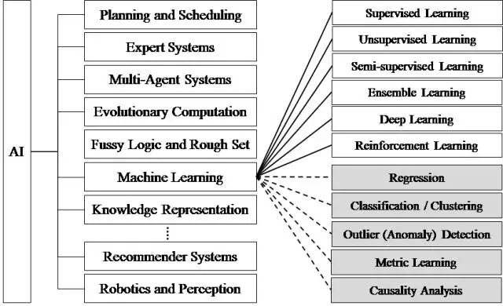

# 什么是`机器学习`
机器学习就是把无序的数据转换成有用的信息
1. 监督学习（必须知道预测什么）
 1. 分类
 1. 回归
1. 无监督学习（数据没有类别信息，不给定目标值）

## 开发机器学习应用的步骤
1. 收集数据(这个和机器学习无关，都自己做)
1. 准备输入数据(这个和机器学习无关，都自己做)
1. 分析输入数据
2. 训练算法（机器学习算法核心）
1. 测试算法（机器学习算法核心）
1. 使用算法（即将算法应用打App。在苹果中，之前的步骤为ML，这一步为Vision） 

# 机器学习的目的，就是利用算法训练`现有`数据，得到`模型`。然后将此模型利用`到实际的应用`

# 结构
1. 监督学习
 1. k-近邻算法
 1. 决策树
 1. 朴素贝叶斯（基于概率论的分类方法）
 1.  Logistic回归
 1. 6.支持向量机
 1.  7.利用AdaBoost元算法提高分类性能
1. 利用回归预测数值型数据
 1. 8.预测数值型数据：回归
 1. 9.树回归
1. 无监督学习
 1. 10.用K-均值聚类算法对未标注数据分组
 1. 11.使用Apriori算法进行关联分析
 1. 12.使用FP-growth算法来高效发现频繁项集
1. 其他工具
 1. 13.利用PCA简化数据
 1. 14.利用SVD简化数据
 1. 15.大数据与MapReduce

## k-近邻算法
## 决策树
## 朴素贝叶斯（基于概率论的分类方法）
## Logistic回归
## 6.支持向量机
## 7.利用AdaBoost元算法提高分类性能
# 利用回归预测数值型数据
## 8.预测数值型数据：回归
## 9.树回归
# 无监督学习
## 10.用K-均值聚类算法对未标注数据分组
## 11.使用Apriori算法进行关联分析
## 12.使用FP-growth算法来高效发现频繁项集
# 其他工具
## 13.利用PCA简化数据
## 14.利用SVD简化数据
## 15.大数据与MapReduce
